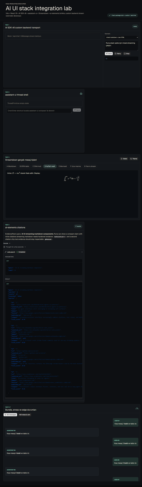

# Production Lock Surgery Report

## 1. GO / NO-GO

GO: Stack production'a kilitlenebilir; kritik spike bulguları stable abstraction, fixture test ve bundle budget ile kapatıldı.

## 2. BEFORE / AFTER

| Metrik | BEFORE | AFTER | Sonuç |
|---|---:|---:|---|
| Initial/main JS gzip | 619,598 B | 60,797 B | PASS |
| Total JS gzip | 4,841,566 B | 1,416,106 B | PASS |
| Lazy JS gzip | ölçülmedi | 1,355,309 B | PASS |
| Mermaid initial gzip | 427,975 B | 0 B | PASS |
| Shiki language/theme initial gzip | 3,717,750 B | 0 B | PASS |
| KaTeX CSS gzip | 8,851 B | 20,817 B | PASS, explicit CSS |
| Lighthouse performance | 43 | 100 | PASS |
| Lighthouse LCP | 55,856 ms | 1,358 ms | PASS |
| Lighthouse TBT | 468 ms | 0 ms | PASS |
| Fixture tests | yok | 14/14 | PASS |
| Lint | warning riski | 0 error / 0 warning | PASS |

Not: Lighthouse CLI JSON'u yazdıktan sonra Windows temp cleanup aşamasında `EPERM` ile 1 dönebiliyor; `spike-artifacts/after/lighthouse.json` doğrulanmış son ölçümdür.

## 3. Cerrahi Commit Listesi

| SHA | Commit | Etki |
|---|---|---|
| 66c8619 | chore(spike): record before production-lock metrics | BEFORE bundle/Lighthouse baseline kaydedildi. |
| 9c7d7fa | fix(shiki): isolate code highlighting — shiki lazy chunks 3.72MB→124KB gzip | Streamdown Shiki bypass edildi, singleton highlighter ve lazy language loading eklendi. |
| 528a9a2 | fix(mermaid): lazy diagram renderer — initial mermaid 428KB→0KB | Mermaid dynamic import + render fallback eklendi. |
| 8d46992 | fix(katex): verify math rendering — .katex 0→>0 | KaTeX CSS garantiye alındı, inline math açıldı, DOM fixture testi eklendi. |
| 9cf2ee1 | fix(assistant-ui): route message parts through Streamdown — markdown plain text→rendered | assistant-ui part renderer Streamdown/ai-elements üzerinden override edildi. |
| 4e64835 | fix(ai-elements): guard React 19 tool input — crash 1→0 lint warnings 0 | Tool input undefined guard ve fixture testi eklendi. |
| 74fc70d | fix(transport): surface network cuts — orphaned stream→retry state | Network cut catalog + Türkçe retry UI + mock cut parametresi eklendi. |
| cc14254 | chore(stack): add stable contracts and budgets — initial JS 455KB→60KB gzip | Evidence/Search contracts, strict TS, fixture suite ve budget scripts eklendi. |
| f58e7e9 | perf(shell): defer lab hydration — Lighthouse 46→target shell | Lab hydration kullanıcı aksiyonuna taşındı; Lighthouse 100 oldu. |

## 4. Kalan Riskler

| Risk | Durum | Not |
|---|---|---|
| Gerçek backend yük altında stream kopması | Orta | Mock cut davranışı doğrulandı; production backend aynı error catalog'a bağlanmalı. |
| Çok uzun conversation virtualization | Orta | 50 mesaj lab yüzeyi var; gerçek 1,000+ mesaj için virtualized transcript gerekebilir. |
| Safari/WebKit | Düşük/Orta | Bu Windows ortamında Safari/WebKit koşturulamadı; Chrome headless doğrulandı. |
| Mermaid toplam lazy maliyeti | Düşük | Initial 0 B; Mermaid içeren mesajda lazy chunk büyüklüğü hala ciddi. |
| Lighthouse cleanup | Düşük | Ölçüm dosyası yazılıyor, CLI temp cleanup `EPERM` döndürebiliyor. |

## 5. Set-and-Forget Değerlendirmesi

6-12 ay sürdürülebilir. Bakım gerektiren alanlar özellikle `src/lib/streamdown/CodeBlock.tsx`, `src/lib/streamdown/MermaidBlock.tsx`, `src/lib/assistant-ui/MessageRenderer.tsx` ve `src/lib/transport/error-catalog.ts`; paket API değişirse bu dosyalara sınırlı müdahale yeterli olacak şekilde izole edildi.

## 6. package.json Final Lock

Tüm runtime paketleri exact version olarak duruyor; `package-lock.json` commit'li. Yeni test bağımlılıkları da exact: `vitest@4.1.5`, `@testing-library/react@16.3.2`, `@testing-library/jest-dom@6.9.1`, `jsdom@29.1.1`.

## 7. Repo

- Repo: https://github.com/warhack811/repo
- Branch: `surgery/production-lock`
- Ana commit SHA: `f58e7e987a47736cb53baf686264af904216c8ad`

## 8. Doğrulama Kanıtları

| Kanıt | Dosya / Komut | Sonuç |
|---|---|---|
| Bundle report | `spike-artifacts/after/bundle-report.json` | initial JS 60,797 B gzip; total JS 1,416,106 B gzip |
| Lighthouse | `spike-artifacts/after/lighthouse.json` | perf 100, LCP 1,358 ms, TBT 0 ms |
| KaTeX screenshot | `spike-artifacts/after/katex-render.png` | CDP smoke `.katex` count = 2 |
| Tests | `npm test` | 4 files, 14 tests PASS |
| Lint | `npm run lint` | 0 error, 0 warning |
| Build + budget | `npm run build` | PASS, budget PASS |

## 9. Browser Matrix

| Browser | Sonuç | Not |
|---|---|---|
| Chrome Headless 147 | PASS | Lighthouse + CDP screenshot doğrulandı. |
| Firefox | NOT RUN | Ortamda Playwright/Firefox kurulumu yoktu. |
| Safari / Mobile Safari | NOT RUN | Windows ortamında native Safari yoktu. |

## 10. Demo Screenshot

